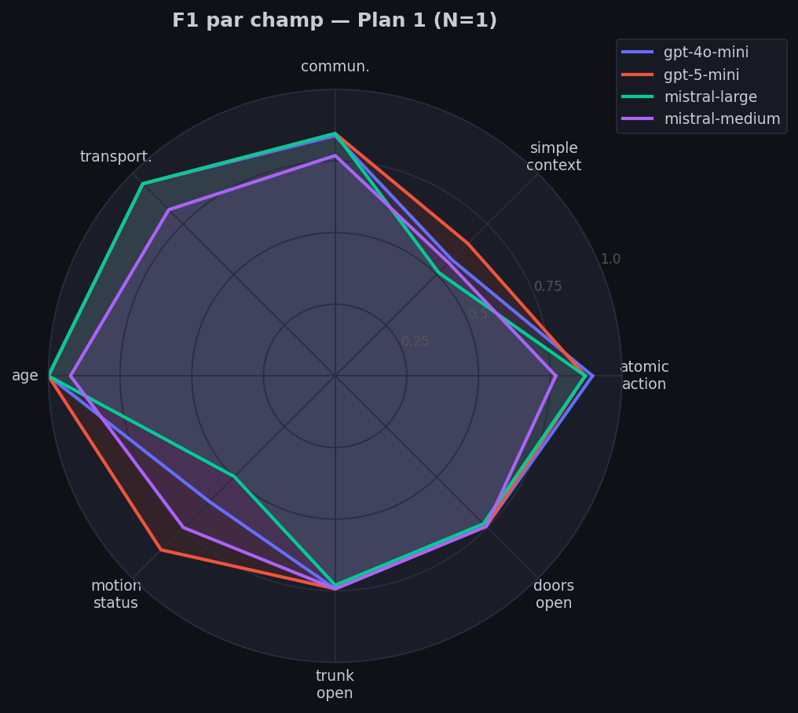
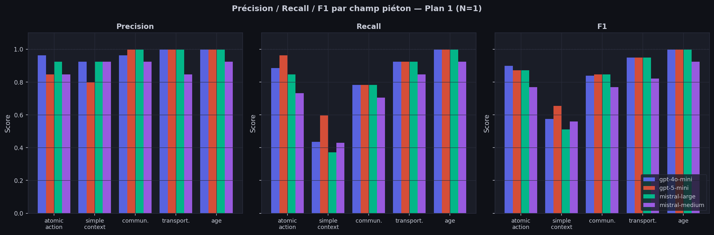
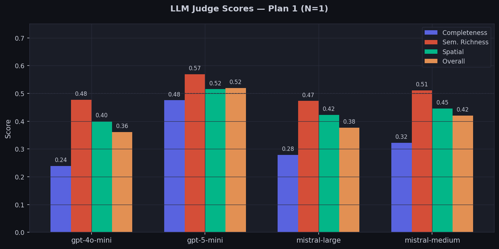
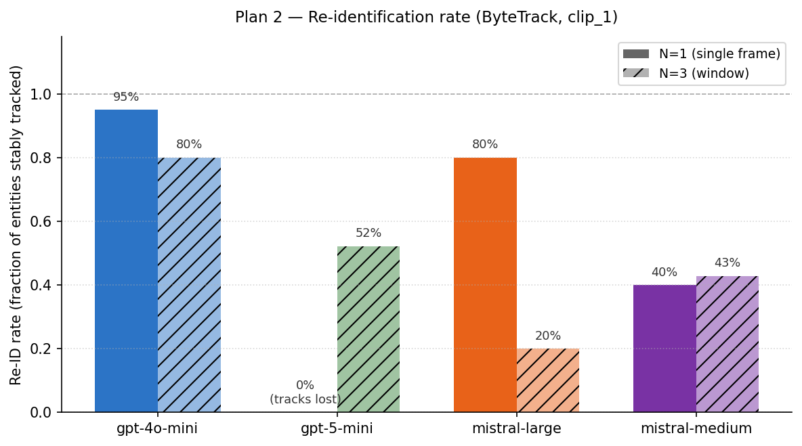
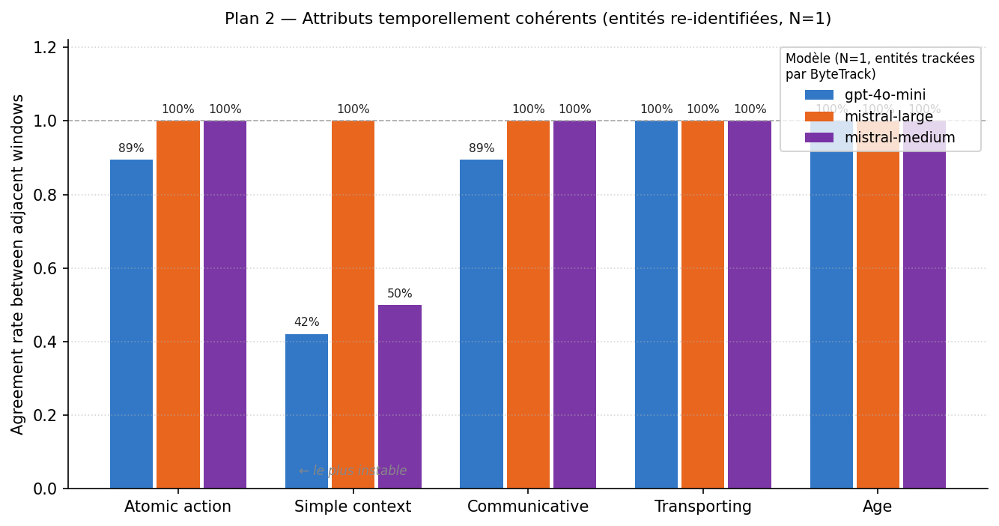
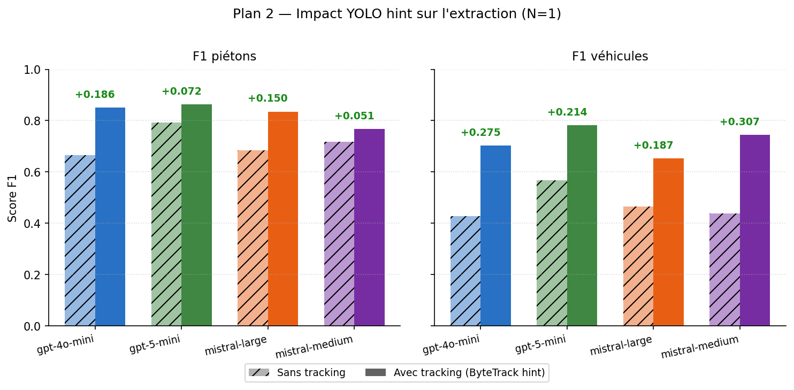
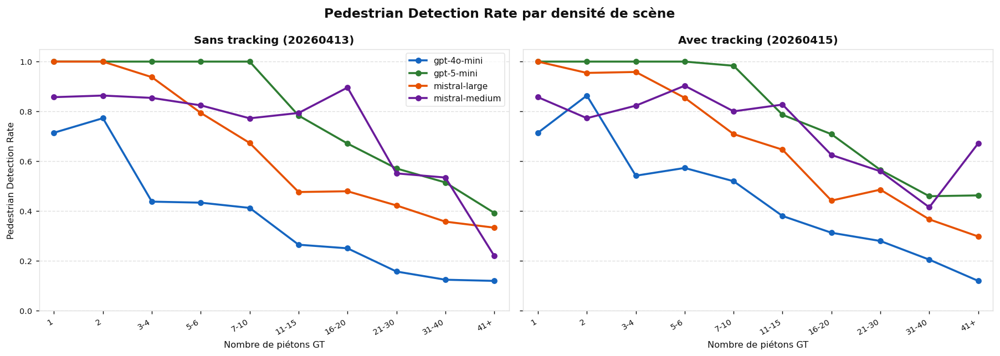
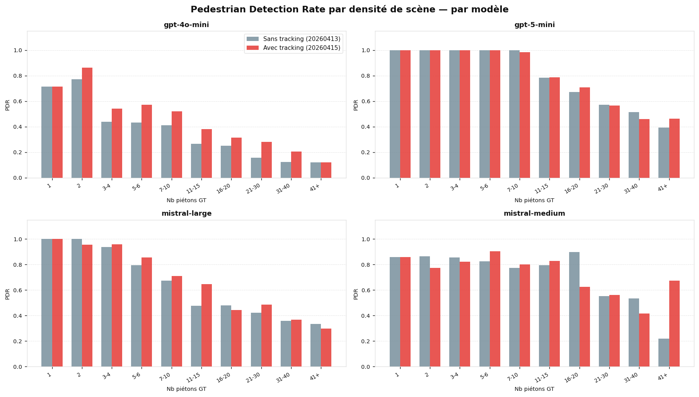
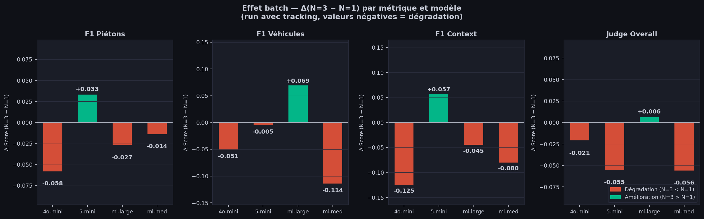

# Semora : Analyse des résultats

## Historique

Les premiers runs ne faisaient appel qu'aux VLMs seuls, sans module externe. Deux problèmes ont rapidement émergé : le tracking par description textuelle était peu fiable, et la détection de piétons chutait significativement dès que la scène dépassait 8 personnes.

L'objectif initial du benchmark était de comparer les modèles entre eux sur la qualité d'extraction brute. Ces observations ont élargi la question : au-delà du choix du modèle, il est possible d'améliorer les performances globales en ajoutant des modules externes. Le Plan 1 évalue l'extraction pure et guide le choix du modèle. Le Plan 2 n'est pas réalisable sans module de tracking externe : les résultats sans YOLO+ByteTrack ne sont pas valides. Le Plan 3 montre que les performances se dégradent significativement sans tracking dès que la densité de scène augmente.

---

## Plan 1 : Qualité d'extraction

**Objectif :** mesurer la capacité des VLMs à extraire correctement les entités et leurs attributs depuis une frame de scène de conduite, et comparer les modèles entre eux.

**Ce qu'on mesure :** la fidélité de l'extraction via deux métriques complémentaires : un F1 symbolique champ par champ (comparaison exacte contre les annotations TITAN) et un score sémantique produit par un LLM juge sur 4 critères : complétude, richesse sémantique, relations spatiales, et score global.

**Comment :** pour chaque modèle, on envoie une frame avec le prompt d'extraction, on parse la sortie JSON, et on calcule les deux scores en parallèle. Les résultats sont agrégés sur 9 clips et comparés inter-modèles.

| Modèle | F1 piétons | F1 véhicules | Complétude | Richesse | Spatial | **Judge overall** |
|---|---|---|---|---|---|---|
| gpt-4o-mini | 0.852 | 0.703 | 0.239 | 0.477 | 0.400 | **0.362** |
| gpt-5-mini | **0.864** | **0.782** | **0.475** | **0.569** | **0.515** | **0.519** |
| mistral-large | 0.835 | 0.653 | 0.279 | 0.473 | 0.423 | **0.377** |
| mistral-medium | 0.768 | 0.745 | 0.322 | 0.512 | 0.446 | **0.420** |

- gpt-5-mini domine sur tous les critères, symbolique et sémantique.
- La **complétude** est systématiquement le critère le plus bas (0.24–0.48) : les modèles décrivent correctement ce qu'ils voient, mais ratent des entités entières.
- `simple_context` est le seul champ avec un recall effondré malgré une précision correcte : les modèles sont sélectifs mais incomplets sur ce champ.

---

## Plan 2 : Tracking et cohérence temporelle

**Objectif :** évaluer si les VLMs maintiennent un identifiant stable pour la même entité d'une frame à l'autre, et mesurer l'impact du module YOLO+ByteTrack sur cette cohérence.

**Ce qu'on mesure :** la consistance des `track_id` à travers les frames d'une séquence. Sans module externe, les identifiants sont déduits par le modèle depuis l'apparence visuelle : les scores sont structurellement gonflés et non comparables. On mesure aussi le delta de F1 entre les deux conditions pour quantifier le gain apporté par le tracking.

**Comment :** YOLO+ByteTrack fournit des `track_hint` stables injectés dans le prompt avant chaque appel VLM. On compare ensuite la consistance des identifiants et les scores d'extraction entre la baseline sans tracking et la condition avec module, sur les mêmes frames et clips.

> **Seule la condition avec tracking est fiable.** Sans YOLO+ByteTrack, les `track_id` sont déduits par le modèle à partir de descriptions textuelles (apparence, position) : deux personnes habillées pareil dans des frames successives reçoivent le même identifiant sans être les mêmes individus. Ce score de cohérence temporelle est structurellement gonflé : c'est de la chance, pas du tracking. Les résultats sans tracking ne sont donc pas comparables sur cette dimension et ne sont présentés ici qu'à titre de baseline F1.

| Modèle | Re-ID (N=1) | Re-ID (N=3) | simple_context | atomic_action | ΔF1 piétons | ΔF1 véhicules |
|---|---|---|---|---|---|---|
| gpt-4o-mini | **95 %** | 80 % | 42 % | 90 % | +0.186 | **+0.276** |
| gpt-5-mini | 0 % | 52 % | — | — | +0.072 | **+0.214** |
| mistral-large | 80 % | 20 % | **100 %** | **100 %** | +0.150 | **+0.187** |
| mistral-medium | 40 % | 43 % | 50 % | **100 %** | +0.051 | **+0.307** |

- gpt-4o-mini obtient le meilleur Re-ID en N=1 (95 %) mais sa cohérence sur `simple_context` reste faible (42 %) : le modèle re-identifie l'entité mais décrit son contexte scénique de façon instable.
- gpt-5-mini perd tous les tracks en N=1 (Re-ID = 0 %) : le modèle ignore les `track_id` injectés dans le prompt. Il récupère partiellement en N=3 (52 %), probablement grâce à la redondance visuelle de la fenêtre multi-frames.
- Pour les modèles qui re-identifient correctement, `age`, `transporting` et `communicative` sont parfaitement stables (100 %) — attributs intrinsèques à l'individu. `simple_context` est le seul champ volatile : il dépend du contexte scénique local qui évolue entre frames.
- Le gain F1 d'extraction est concentré sur les **véhicules** (+0.19 à +0.31) : le hint YOLO localise les bboxes avec précision, rendant `trunk_open` et `doors_open` accessibles. C'est une métrique secondaire — elle mesure l'effet du hint sur l'extraction, pas la qualité du tracking en lui-même.

---

## Plan 3 : Montée en complexité (PDR)

**Objectif :** évaluer comment les performances des VLMs évoluent quand la densité de scène augmente, et identifier le seuil à partir duquel les modèles se dégradent significativement.

**Ce qu'on mesure :** la PDR (Pedestrian Detection Rate : `min(n_pred, n_gt) / n_gt`) stratifiée par palier de densité de scène, avec et sans tracking. Le `min` évite de récompenser les hallucinations.

**Comment :** le Complexity Sampler sélectionne les frames par densité GT (n_personnes + n_véhicules) pour couvrir le spectre easy → hard. Les résultats sont comparés entre la baseline sans tracking et la condition YOLO+ByteTrack sur 100 frames.

### Run 1 vs Run 4 : Baseline sans tracking vs YOLO+ByteTrack

**Run 1** (`20260413_101247`) : tracking désactivé, 100 frames, sampler densité.
**Run 5** (`20260415_144802`) : YOLO+ByteTrack activé, detect_with_context (4 frames contexte), 100 frames.

| Modèle | Run 3 : Sans tracking (mean ± std) | Run 5 : Avec tracking (mean ± std) | Δ |
|---|---|---|---|
| gpt-4o-mini | 0.346 ± 0.274 | **0.443 ± 0.309** | +0.097 |
| gpt-5-mini | 0.776 ± 0.236 | **0.771 ± 0.245** | −0.005 |
| mistral-large | 0.628 ± 0.271 | **0.655 ± 0.275** | +0.027 |
| mistral-medium | 0.695 ± 0.255 | **0.676 ± 0.273** | −0.019 |

- Sans tracking, la PDR s'effondre dès **5–8 piétons** dans la scène pour tous les modèles.
- Le tracking YOLO+ByteTrack est le facteur déterminant : +0.04 à +0.26 selon le modèle.
- L'écart-type de gpt-5-mini chute de 0.236 → 0.128 avec tracking : le hint stabilise les prédictions.
- Au-delà de 16 piétons, même avec tracking la PDR chute : limite intrinsèque de YOLO en forte occlusion.
- gpt-4o-mini est le plus dépendant du hint externe (+0.255).

---

## Observation : Effet de dilution de l'attention (N > 1)

En testant des fenêtres multi-frames (N=3), un effet non anticipé a été observé : **envoyer plusieurs frames en batch dégrade la qualité d'extraction** par rapport à N=1.

Le mécanisme est le suivant : le modèle reçoit N images simultanément pour une seule réponse, et dilue son attention sur l'ensemble de la fenêtre plutôt que de traiter finement la frame cible. Les attributs visuels fins (`trunk_open`, `doors_open`) sont les premiers touchés.

- F1 véhicules chute pour tous les modèles entre N=1 et N=3.
- `simple_context` est le champ le plus sensible (Δ −0.045 à −0.125).
- **Seule exception :** gpt-5-mini gagne +0.033 en F1 piétons avec N=3 : le seul modèle qui exploite le contexte temporel sans se noyer.
